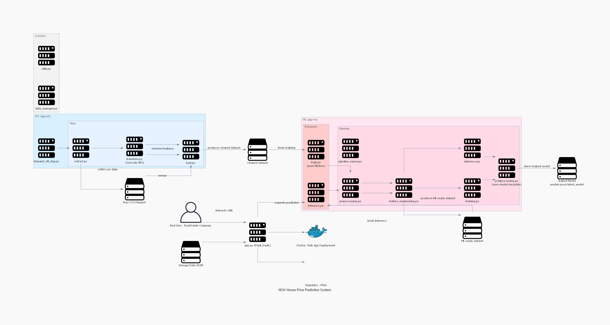

# Predictive Property Intelligence System

## Overview
This project predicts house prices in New South Wales (NSW) and provides summary insights such as:

- Summary statistics of numeric features  
- Distribution plots for selected features  
- Average values by postcode  
- Scatterplots of price vs selected features  

It is designed for both normal users exploring house prices and real estate companies for decision support.

---

## 🚀 Features

- **Price Prediction:** Predict house prices using XGBoost  
- **Data Analysis:** Explore distributions, summary statistics, and feature correlations  
- **Postcode Insights:** Average numeric values for each postcode  
- **Interactive UI:** Visualize predictions and feature analysis in an easy-to-use dashboard  

---

## 📁 Project Workflow



---

## ⚙️ Pipelines

### 1. ETL Pipeline
- **Extract & Transform:** Scrape raw housing data from web sources, using Kafka and Spark for handling real-time data streaming. 
- **Load:** Save scraped data into .parquet file format and Cassandra database for model training and data query.
- **Schedule:** The ETL is triggered by Prefect

### 2. ML Pipeline
- **Preprocessing:** Handle missing values, convert dtypes, and clean data  
- **Feature Engineering:** Create derived features like `price_per_m2`, `distance_to_city`, and postcode averages  
- **Training:** Train XGBoost model, and compare to Linear Regression baseline model.  
- **Inference:** Make real-time predictions.  
- **Postprocessing:** Format outputs and store predictions  

---

## 🚀 Quick Start

### 0. Clone the repository
```bash
git clone
cd end_to_end_house_price_prediction
```

### 1. Running data scraping with Kafka, Spark and Prefect with training pipeline
```bash
# Deploy all services with production configuration
docker compose up -d
```

```bash
# Starting scraping with Kafka producer and Spark streaming at the same time
python .\app-etl\dags\demand_etl_dag.py
python .\app-etl\tasks\load.py
```

```bash
# Training pipeline
python .\app-ml\entrypoint\train.py
```

### 2.1: Running Application in Docker

```bash
docker run -p 5000:5000 house-price-app


# Access the application
#  * Running on all addresses (0.0.0.0)
#  * Running on http://127.0.0.1:5000
#  * Running on http://172.17.0.2:5000
```

### 2.2: Access the web application via Render.com (https://house-price-app-q9bm.onrender.com)


## 📁 Project Architecture & Data Flow
```text
├── .gitignore
├── Dockerfile
├── app-etl
│   ├── dags
│   │   └── demand_etl_dag.py
│   └── tasks
│       ├── extract.py
│       ├── load.py
│       └── transform.py
├── app-ml
│   ├── entrypoint
│   │   ├── inference.py
│   │   └── train.py
│   └── src
│       ├── __init__.py
│       └── pipelines
│           ├── feature_engineering.py
│           ├── inference.py
│           ├── pipeline_runner.py
│           ├── postprocessing.py
│           ├── preprocessing.py
│           └── training.py
├── app.py
├── common
│   ├── __init__.py
│   ├── data_manager.py
│   └── utils.py
├── config
│   └── config.yaml
├── docker-compose.yml
├── models
│   └── prod
│       └── latest_model
├── nsw_house_price_prediction_system.png
├── readme.md
├── requirements.txt
├── templates
│   ├── analysis.html
│   ├── home.html
│   └── prediction.html
```

## 📊 Data & Insights

- **Summary Statistics**  
  Provides mean, median, standard deviation, minimum, and maximum values for numeric features.

- **Feature Distribution**  
  Visualizes feature distributions using histograms and Kernel Density Estimation (KDE) plots.

- **Postcode Insights**  
  Computes and presents average numeric values for each postcode.

- **Scatter Plots**  
  Shows price versus feature relationships for deeper analysis and correlation.

---

## 📜 License

This project is licensed for **personal and educational use only**.

- **✅ Free** to explore, fork, and modify for learning purposes.  
- **❌ Not allowed** for commercial use without explicit permission.
